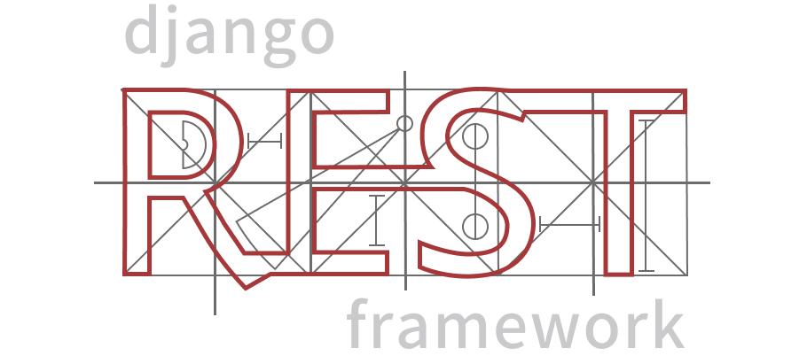

# Unified Financial Operations Platform (UFOP)

A white labeled, multi tenant financial operations platform. The platform adopts to the unique needs for different organizations. Unlike rigid, single-purpose software, our platform evolves with our clients.

Currently, we are launching the platform to serve our immediate client—an NGO requiring a donation portal with automated tax receipts. However, the underlying architecture is designed to instantly transform into a full-fledged bookkeeping system for Small and Medium Businesses (SMBs) or a personal expense tracker for individual users, all from the same codebase.

**Our mission:** Single source of truth for an organization’s financial lifeblood, _from the moment a payment is initiated, to the final entry in their accounting ledger._

## Tech Stack

<p align="center">
  
  
  
  
  
  
</p>

---

| Component          | Technologies                                                          |
| :----------------- | :-------------------------------------------------------------------- |
| **Backend**        | django (5.2), django-rest-framework, django-tenants, django-constance |
| **Frontend**       | Vue 3 (Composition API), Vite, Vuetify 3, Pinia                       |
| **Worker/Queue**   | Celery, Valkey                                                        |
| **Database**       | PostgreSQL                                                            |
| **Infrastructure** | Docker, Compose, Poetry, Pre-Commit                                   |

## Directory Structure

```
project-root/
	|- .agents/ 			# Common agentic configs, skills, plugins
	|- .vscode/				# IDE settings for vscode
	|- .github/				# Github related settings
	|- documentation/		# Project wide documentation, architecture and assets
	|- backend/				# Complete Backend Application
	|- frontend/			# Complete Frontend Application
	|- compose/				# Dockerfile(s) and docker-compose configurations
	- .gitignore
	- .dockerignore
	- .env.example
	- .pre-commit-config.yaml
```

- **`backend/`**: Contains the complete Django project, including apps, configuration, and management scripts.
- **`frontend/`**: Contains the Vue 3 SPA, including components, assets, and build configuration.
- **`compose/`**: Docker Compose configuration files for various environments.
- **`documentation/`**: Architectural specifications, diagrams, and developer guides.
- **Root Directory**: Houses environment variables (`.env`), CI/CD configurations, repository-wide tools (`Makefile`, `pre-commit`), and project metadata.

### Reason behind the directory structure

This structure is designed to leverage **Docker BuildKit's** context isolation:

- During the backend build, only the `backend/` directory is provided as context.
- During the frontend build, only the `frontend/` directory is provided as context.

This eliminates accidental leakage of irrelevant code (e.g., frontend source in the backend image) and ensures that changes in one domain do not unnecessarily invalidate the build cache of the other.
This also gives us future scope of easily splitting backend from frontend.

## Documentation Hub

The project believes in clearly documenting what is being built or added, general idea is to start from a brainstormed plan and at the end of feature the documentation should be clearly able to describe the feature, mindset behind it and what is solves.
The Documentation should clealy answer: _What_, _Why_ and _How_.<br/>
Each Documentation directory has a dedicated `Readme.md` file that has general overview and also contains index to the rest of the documentation files.<br/>

```
documentation/
	|- business-requirement-documents/
	|- technical-architecture/
	|- logos/
```

- [**business-requirement-documents:**](./documentation/business-requirement-documents/Readme.md) Houses all the business related documentation, this gives a product side pov and overview of a feature and its implementation.
- [**technical-architecture:**](./documentation/technical-architecture/Readme.md) Houses all the technical high level design and architecture for a feature or functionality.
- [**logos:**](./documentation/logos/) Logos used across the repository.

## Local Development Setup

### Makefile hierarchy

### Quick Start Local Setup

```bash
make build 		# Builds the entire project image(S)
make run 		# Run (Build Conatiners) from built image(s) attached
```

Seed local data using:

```bash
make setup			# Run all the seeder(s) and get complete local setup
make light-setup	# Only setup tenant(s) and users
```

## User Credentials (Local Development)

The following pre-configured accounts are available for testing:

| Role                         | Username              | Password     | Domain                     |
| :--------------------------- | :-------------------- | :----------- | :------------------------- |
| **Platform Admin**           | `admin@localhost.com` | `qwerty@123` | `localhost:8000`           |
| **Tenant Admin (NGO)**       | `admin@localngo.com`  | `qwerty@123` | `localngo.localhost:8000`  |
| **Tenant Admin (Restraunt)** | `admin@restraunt.com` | `qwerty@123` | `restraunt.localhost:8000` |
| **Client/User (NGO)**        | `client@localngo.com` | `qwerty@123` | `localngo.localhost:8000`  |

_Note: Map these domains to `127.0.0.1` in your `/etc/hosts` file for local testing._
